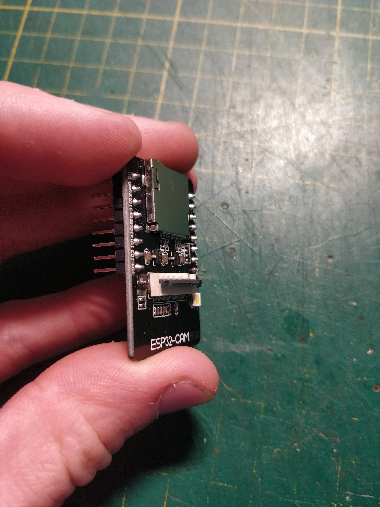
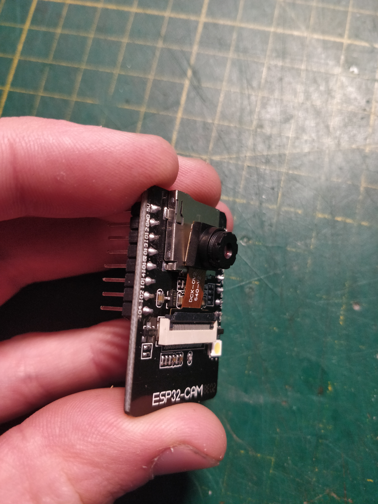

# SPE Karlsruhe - KI-Gadget
## Aufbauanleitung

Als erstes werden die Widerstände für die LEDs verlötet. dazu müssen zunächst die Beine der Widerstände im passenden Abstand umgebogen werden:

Anschließend werden die Widerstände durch die Platine gesteckt und auf der Rückseite verlötet.

Die überstehenden Beine der Widerstände werden mit einem Seitenschneider abgeknipst.

Nun werden die Buchsenleisten für Mikrocontroller und Bewegungsmelder verbaut. Diese müssen zunächst mit einem Seitenschneider auf die richtige Länge gekürzt werden:

Die Buchsenleisten für den Mikrocontroller werden auf diesen aufgesteckt, dann wird das Ganze in die Platine gesteckt:

...und auf der Rückseite verlötet. Der Mikrocontroller wird danach wieder abgezogen.

Die Buchsenleiste für den Bewegungsmelder wird einzeln aufgesteckt und verlötet.
Nun sollte die Platine so aussehen:

Als nächstes werden die Stiftleisten verlötet, auch diese müssen zunächst gekürzt werden:

...dann werden auch sie durch die Platine gesteckt und verlötet. Das Ganze sieht danach so aus:

Nun werden die LEDs mit etwas Abstand in die Platine gesteckt. Dabei muss auf die Polarität geachtet werden: der Plus-Pol der LEDs, also das längere Beinchen, zeigt zur Mitte des Gadgets.

Auch die LEDs werden auf der Rückseite verlötet. Auch hier werden die überstehenden Beine mit dem Seitenschneider abgeknipst.
Zuletzt wird der Lautsprecher verlötet. Auch bei diesem muss auf die Polarität geachtet werden: Das + - Symbol auf Lautsprecher und Platine müssen übereinander liegen. Der Lautsprecher wird wie alle anderen Komponenten durch die Platine gesteckt und auf der Rückseite verlötet.
Die fertig verlötete Platine sieht so aus:

Nun wird die Kamera mit dem Bewegungsmelder verbunden. dazu wird der Verbinder auf der Vorderseite des Mikrocontrollers aufgeklappt, die Kamera eingesteckt und der Verbinder wieder zugeklappt.

        
        
        

Zuletzt werden Mikrocontroller, Bewegungsmelder und Steckbrücken auf die Platine aufgesteckt, damit ist das Gadget fertig zusammengebaut!

